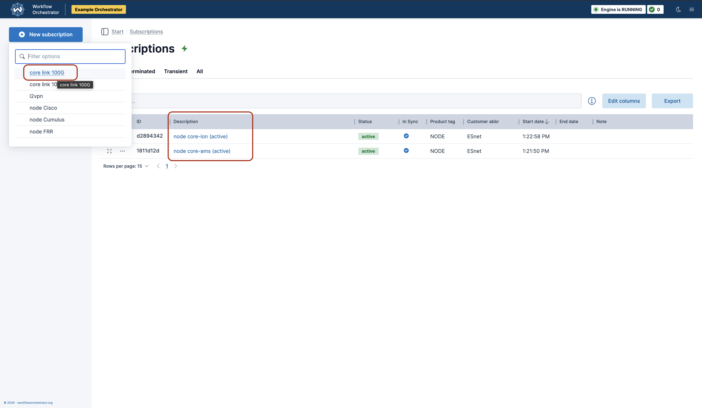
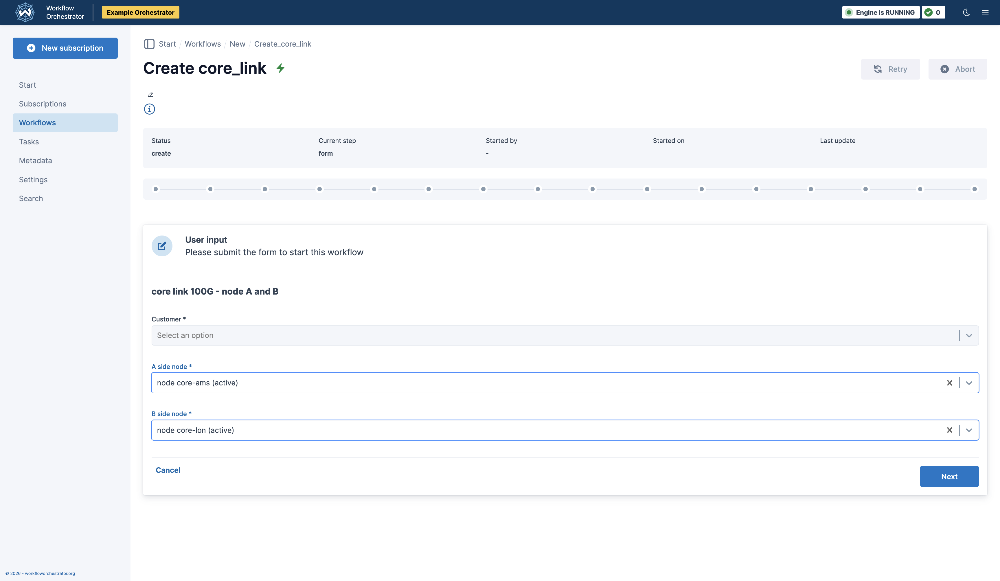
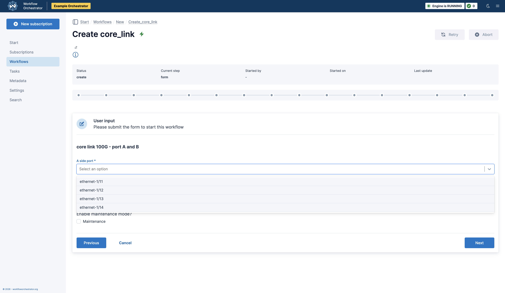
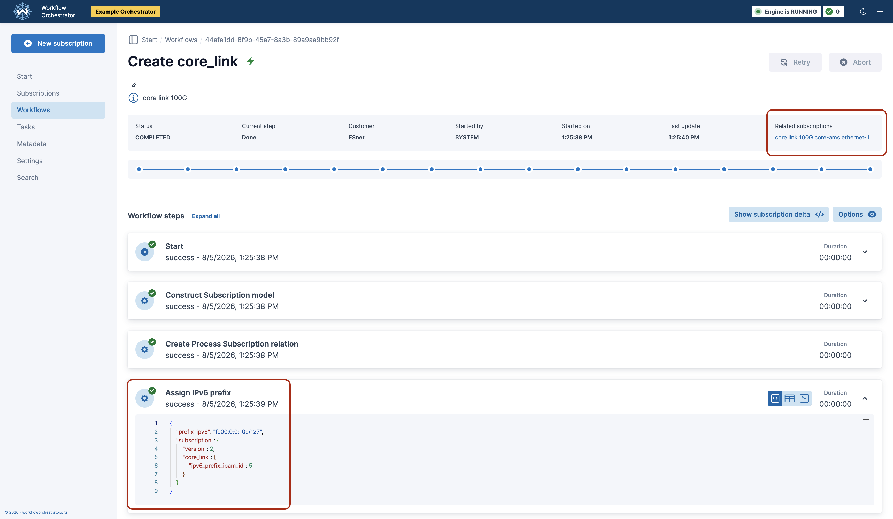
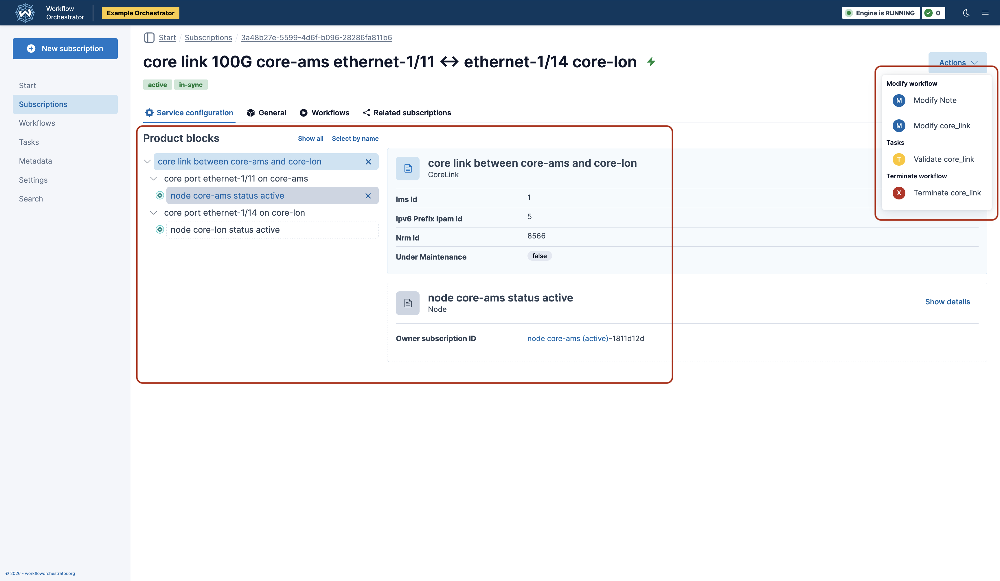
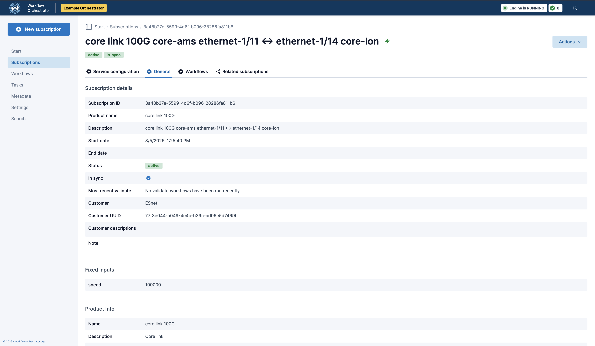

# Workflow Orchestrator At A Glance

!!! info
    This article is for potential adopters considering Workflow Orchestrator (WFO) for their organization.
    It avoids software implementation details and favors high-level terminology over the finer semantics of WFO's database models.

Workflow Orchestrator is a software framework for modeling the lifecycle of subscriptions to arbitrary products.
The framework is open-source and written in the Python programming language.
In organizations using WFO, software teams define **products** using the framework, along with **workflows** by which end-users manage each product's lifecycle.

When a user subscribes a customer to a product, they run a **create** workflow, which produces a **subscription** to that product.
That subscription can then be orchestrated by the other workflows associated with its product.
For example, **validate** workflows ensure WFO's database is kept in sync with any external resources allocated to a subscription, and **terminate** workflows deprovision the subscription along with those external resources.

# Scenario: Adding a Link
!!! info
    In this section, we highlight the experience of an end-user: in this case, a network operator setting up a link between two routers.
    While this example focuses on networking, WFO can be used for any kind of service, and provides no specific support for network products.

    All screenshots are from the [example-orchestrator][example-orchestrator] project, which you can set up yourself to explore the product further.

Suppose that we have nodes in Amsterdam and London, and we want to establish a core link between them.

On the Subscriptions page, we can see that we already have a subscription for each node, so we create a link via the New Subscription dropdown.

We're then taken to a form for creating the new core link.
As seen below, the form is multi-part with choices pregenerated for the fields.

In this case, the choices are generated dynamically from a Netbox inventory. Workflow Orchestrator makes it easy for software developers to generate templated forms entirely on the backend using the [Pydantic Forms][pydantic-forms] package, with no front-end code required.

After submitting each part of the form, the Create workflow is started.
A workflow is composed of multiple steps, and the status of each step is visible in the UI as it completes.
Any step that generates data can be expanded in the UI to view its output.
Below, we can see the output of the Assign IPv6 Prefix step.

A link in the upper-right corner of the workflow output (above) takes us to the subscription we created (below.)

On the left, we can see various details about both the Core Link subscription, the ports on either end, and the nodes (also subscriptions) each port resides on.

On the right, the Actions dropdown lists the workflows available to us for further managing the subscription's lifecycle.

The General tab provides more extensive information about the subscription.

# Additional Actions
Above, we saw the Actions available to manage a Core Link subscription after it was created.

`Modify core_link`: Users can define modify workflows to update the subscription database and/or an orchestrated external resource. Users define modify workflows for each subscription to facilitate changes mid-lifecycle.

`Validate core_link`: Users can define validation workflows to verify the data in the WFO database against the external systems it manages. An error in a validation workflow places the corresponding subscription in an Out of Sync state, which flags it for remediation and blocks its workflows. For example, if WFO manages a resource in Netbox and that resource is then edited directly in Netbox, this could be detected with a validation workflow.

Validation workflows are commonly run overnight using WFO's [scheduling](../../orchestrator-core/guides/tasks/) features, which can be customized to run at any time or frequency.

`Terminate core_link`: Users can define terminate workflows in order to deprovision a subscription and any resources orchestrated on its behalf. Terminated subscriptions are still accessible for reference.

Users aren't limited to these workflows.
For example, it can be helpful to create distinct modify workflows for the same product to make unrelated changes.

# Behind the Scenes

So what's actually happening behind the scenes when we run these workflows?

WFO provides none of the facilities for talking to Netbox, NSO, Ansible, etc.
These features are implemented by other packages or by the software team leveraging the framework.

In particular, each workflow is created from a number of user-defined **steps**.
A step is just a Python function that can be re-used by developers across workflows.
Usually, each step is responsible for interacting with an external resource: an inventory system, a database, a network device, an HTTP API, etc.
When a workflow fails for some reason, it can be retried beginning at whichever step failed.

If you want to see the code for yourself, the above example came from the [example-orchestrator][example-orchestrator] repo.
The Core Link producted is defined by a [Product][example-core-link-product-type] and its constituent [Product Blocks][example-core-link-product-blocks], along with its [workflows][example-core-link-workflows].
The workflows update the inventory system, Netbox, via [services/netbox.py][example-core-netbox-service].
By convention, user-defined modules for interacting with external services are organized under `services/`.

[nren-wikipedia]: https://en.wikipedia.org/wiki/National_research_and_education_network
[pydantic-forms]: https://workfloworchestrator.org/pydantic-forms/
[example-orchestrator]: https://github.com/workfloworchestrator/example-orchestrator
[example-core-link-product-type]: https://github.com/workfloworchestrator/example-orchestrator/blob/main/products/product_types/core_link.py
[example-core-link-product-blocks]: https://github.com/workfloworchestrator/example-orchestrator/blob/main/products/product_blocks/core_link.py
[example-core-link-workflows]: https://github.com/workfloworchestrator/example-orchestrator/tree/main/workflows/core_link
[example-core-netbox-service]: https://github.com/workfloworchestrator/example-orchestrator/blob/main/services/netbox.py
