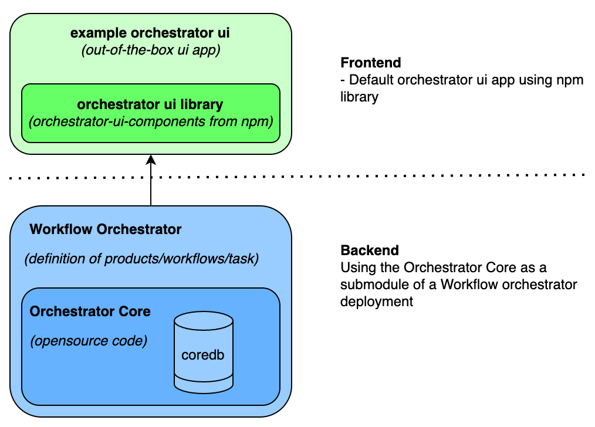
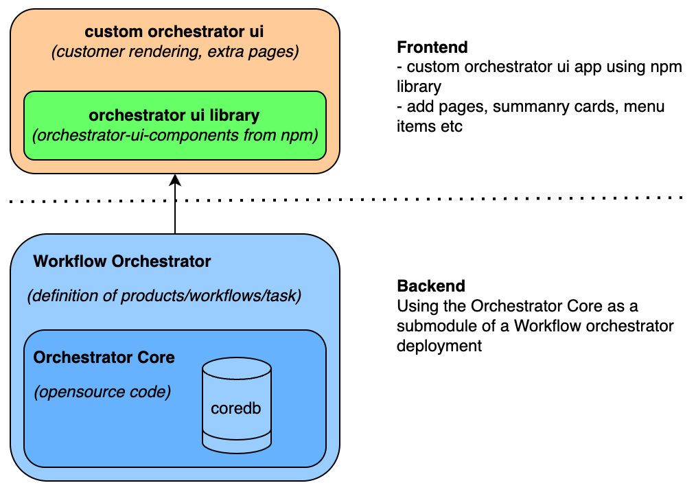

# Components

The Workflow Orchestrator programme contains multiple components for both the frontend and backend, as shown below:

## Backend

### Orchestrator Core

The `orchestrator-core` component is an open-source backend component, which defines the ruleset for product modeling
and workflows. The `orchestrator-core` is a mandatory component to have a functional workflow orchestrator application.
It is written in Python and makes use of other established frameworks like FastAPI, Pydantic and SQLAlchemy.  
It cannot run standalone, since it is a library that contains no definition of products or workflows.

### Workflow Orchestrator

The `Workflow Orchestrator` is the custom implementation of the orchestrator backend. It is the application in which you
define your products, workflows and tasks to create/modify/terminate/validate your product instances, the so-called
`subscriptions`. All product modeling, tasks/workflows and subscription details are stored in the `orchestrator-coredb`
which is part of the orchestrator-core package. This custom implementation of the workflow orchestrator uses
`orchestrator-core` as a library.

With the two backend components set up correctly, you'll have a running Workflow Orchestrator instance accessible via
the API. Additionally, with minimal effort, you can have a fully functional frontend application running on top of it.

### Example Orchestrator

An example of the `Workflow Orchestrator` using the `orchestrator-core` with some example products and workflow are
available [here][example-orchestrator].

## Frontend

### Workflow Orchestrator UI library

The Workflow Orchestrator UI can also be split into 2 major components. A frontend library called the `components orchestrator-ui` library as available on [npm](https://www.npmjs.com/package/@orchestrator-ui/orchestrator-ui-components). And the out-of-the-box `Workflow Orchestrator UI`, which uses the npm library in it's pages. The example of this frontend is the `example-orchestrator-ui` and can be found [here](https://github.com/workfloworchestrator/example-orchestrator-ui). In most cases the example orchestrator is the best deployment model to start with, as is contains a fully functional userinterface, while you can focus your effort on developing products, workflows and tasks.

### More advanced UI deployment models

By tweaking the `example-orchestrator-ui` it is possible to easily add extra pages, cards on dashboard page, or change the rending of certain resource type. Examples of the possible changes is shown [here](orchestrator-ui.md) . This will leverage the default architecture, like shown below:

Another approach could be to use individual components from the npm library and build your own application or integrate the components in an existing application.

## Tooling

The WFO programme maintains an entire ecosystem of tooling, a non-comprehensive list in no particular order:

- [Orchestrator-Core][core]: Python library that makes up the orchestration engine. Downloads:
  .
- [Orchestrator-UI][ui-library]: Component
  library for our NextJS app on top of the Orchestrator-core. Downloads:
  [][ui-library].
- [Example Orchestrator UI][example-ui]:
  Example UI with a NextJS implementation of our component library.
- [LSO][lso-docs]: This application provides an API layer on top of
  Ansible playbooks.
- [Example Orchestrator][example-orchestrator]: This
  repository houses a Docker-compose running a full stack of the Orchestrator, UI and Netbox. It
  includes examples our best (coding) practices and an example integration with Netbox.
- [Pydantic-Forms][pydantic-forms]: A library that includes
  standardized Python Form classes that can be used when generating form components from
  JSON-schema.
- [SuPA][supa-docs]: An NSI Ultimate provider agent with a gRPC API.
- [PolyNSI][polynsi]: A bidirectional SOAP to gRPC translating proxy server for the NSI protocol.

[core]: https://github.com/workfloworchestrator/orchestrator-core
[example-orchestrator]: https://github.com/workfloworchestrator/example-orchestrator
[ui-library]: https://github.com/workfloworchestrator/orchestrator-ui-library
[example-ui]: https://github.com/workfloworchestrator/example-orchestrator-ui
[lso-docs]: https://workfloworchestrator.org/lso
[pydantic-forms]: https://github.com/workfloworchestrator/pydantic-forms
[supa-docs]: https://workfloworchestrator.org/SuPA
[polynsi]: https://github.com/workfloworchestrator/polynsi
