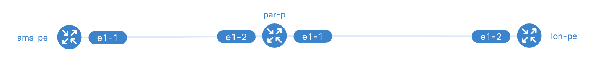

# Bootstrapping the environment

This section describes how you can run the orchestrator-core, orchestrator-ui, and netbox with Docker Compose. We have this all
setup in our docker-compose.yml file so that you don't have to think about how to start the applications required for this workshop!

The following Docker images are used in this workshop:

* [orchestrator-core](https://github.com/workfloworchestrator/orchestrator-core/pkgs/container/orchestrator-core): The workflow orchestrator step engine.
* [example-orchestrator-ui](https://github.com/workfloworchestrator/example-orchestrator-ui/pkgs/container/example-orchestrator-ui): An example GUI implementation for the orchestrator-core.
* [netbox](https://docs.netbox.dev/en/stable/): An open source IPAM and NSoT system.
* [postgres](https://hub.docker.com/_/postgres): The PostgreSQL object-relational database system.
* [redis](https://redis.io/): An open source in-memory data store.
* [containerlab](https://containerlab.dev/): A free network topology simulator that uses containerized
  Network Operating Systems.

## Prerequisites

The following software is required on your machine to follow this workshop:

- [docker-compose](https://docs.docker.com/compose/install/)
- [containerlab](https://containerlab.dev/install/)


!!! info
    For MacOS ARM there is no `containerlab` executable.
    You can run the `containerlab` commands in this guide from within this container provided by the maintainers.
        ```shell
        docker run --rm -it --privileged \
        --network host \
        -v /var/run/docker.sock:/var/run/docker.sock \
        -v /var/run/netns:/var/run/netns \
        -v /var/lib/docker/containers:/var/lib/docker/containers \
        --pid="host" \
        -v $(pwd):$(pwd) \
        -w $(pwd) \
        ghcr.io/srl-labs/clab bash
        ```

## Step 1 - Cloning the repo

The fist step is to clone the Example orchestrator repository using:

```
git clone https://github.com/workfloworchestrator/example-orchestrator.git
```
At this point, you have a functional environment to start play with. This includes:

* The orchestrator (core and GUI)
* Netbox (the entire stack including database, workers, etc...)
* LSO (to run ansible playbooks)
* An example containerlab topology based on Nokia SRlinux.
* Some examples of Ansible playbooks

The directory contains at least these files and directories:

```
$ ls -1
alembic.ini
ansible
clab
db
docker
docker-compose.yml
main.py
migrations
products
README.md
services
settings.py
templates
translations
utils
workflows
wsgi.py
```

## Step 2 - Preparing the environment

**Check port availability**

The environment requires several ports to be free.
Use the command matching your OS to check if any are in use.

On Linux you can use `netstat` or `ss`:

```
# net-tools
netstat -tulnp | grep -E ':80|:3000|:4000|:5432|:5678|:8000|:8001|:8080'

# iproute2
ss -tulnp | grep -E ':80|:3000|:4000|:5432|:5678|:8000|:8001|:8080'
```

On macOS:

```
lsof -nP -iTCP -sTCP:LISTEN | grep -E ':80 |:3000 |:4000 |:5432 |:5678 |:8000 |:8001 |:8080 '
```

No output means that all required ports available.
Otherwise, track down and stop the corresponding processes before continuing.

**Setup variables**

Load the required environment variables:

```shell
source .env.workshop
```

**Pull and build images**

Just in case you have any of the docker images cached on your machine we'll explicitly pull and build them.

```shell
docker compose pull
docker compose build
```

## Step 3 - Starting the environment

Now we can the containers:

```shell
docker compose up -d
```

You should be able to view the applications here:

1. Orchestrator ui: [Frontend: http://localhost:3000](http://localhost:3000)
2. Orchestrator backend: [REST api: http://localhost:8080/api/redoc](http://localhost:8080/api/redoc) and
   [Graphql API: http://localbost:8080/api/graphql](http://localhost:8080/api/graphql)
3. Netbox (admin|admin): [Netbox: http://localhost:8000](http://localhost:8000)

!!! note
    Take your time to familiarise with the applications and make sure they are working correctly.

    If anything is wrong, inspect the results of these commands:

    ```shell
    # Check the status of all services
    docker compose ps

    # Follow the logs of all services
    # It can be helpful to keep this command running in a separate terminal
    docker compose logs -tf -n 5
    ```

## Step 4 - Containerlab

Now that we have our orchestrator stack running, we can spin up the containerlab topology:

```
cd clab
containerlab deploy
```

At the end of this process we can use `containerlab inspect` to check the status of our topology:

```
╭───────────────────────┬──────────────────────────────┬─────────┬────────────────╮
│          Name         │          Kind/Image          │  State  │ IPv4/6 Address │
├───────────────────────┼──────────────────────────────┼─────────┼────────────────┤
│ clab-orch-demo-ams-pe │ srl                          │ running │ 172.18.0.12    │
│                       │ ghcr.io/nokia/srlinux:25.7.1 │         │ N/A            │
├───────────────────────┼──────────────────────────────┼─────────┼────────────────┤
│ clab-orch-demo-lon-pe │ srl                          │ running │ 172.18.0.11    │
│                       │ ghcr.io/nokia/srlinux:25.7.1 │         │ N/A            │
├───────────────────────┼──────────────────────────────┼─────────┼────────────────┤
│ clab-orch-demo-par-p  │ srl                          │ running │ 172.18.0.13    │
│                       │ ghcr.io/nokia/srlinux:25.7.1 │         │ N/A            │
╰───────────────────────┴──────────────────────────────┴─────────┴────────────────╯
```

!!! info
    You will see a few deprecation notices about type `ixrd2` being deprecated, you can ignore this.

And with the command:

```
containerlab graph
```

This will serve a nice rendering of the topology on port [50080](http://localhost:50080).

!!! info
    When using containerlab's docker image, this does not work.

The topology we are going to use is something like this one:



The Example orchestrator used in this workshop already has a number of products pre-configured and ready to be used:

* Nodes (including Ansible to deploy example config)
* Core-links (including Ansible to deploy/delete example config)
* Ports
* L2VPN

We can start feeding initial data into the environment and run some workflows!

## Helpful Items

### Resetting Your Environment

To completely reset your environment and start from scratch, follow these steps.

If you had containerlab deployed, destroy the deployed nodes:

```shell
containerlab destroy
```

Stop the docker compose stack and remove all volumes:

```shell
docker compose down -v
```

You can then restart the environment as described above.
